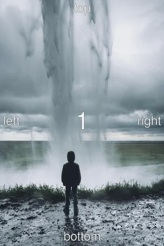
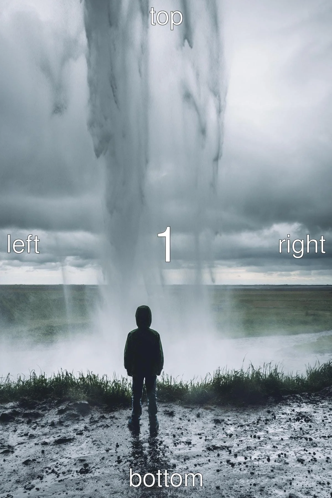
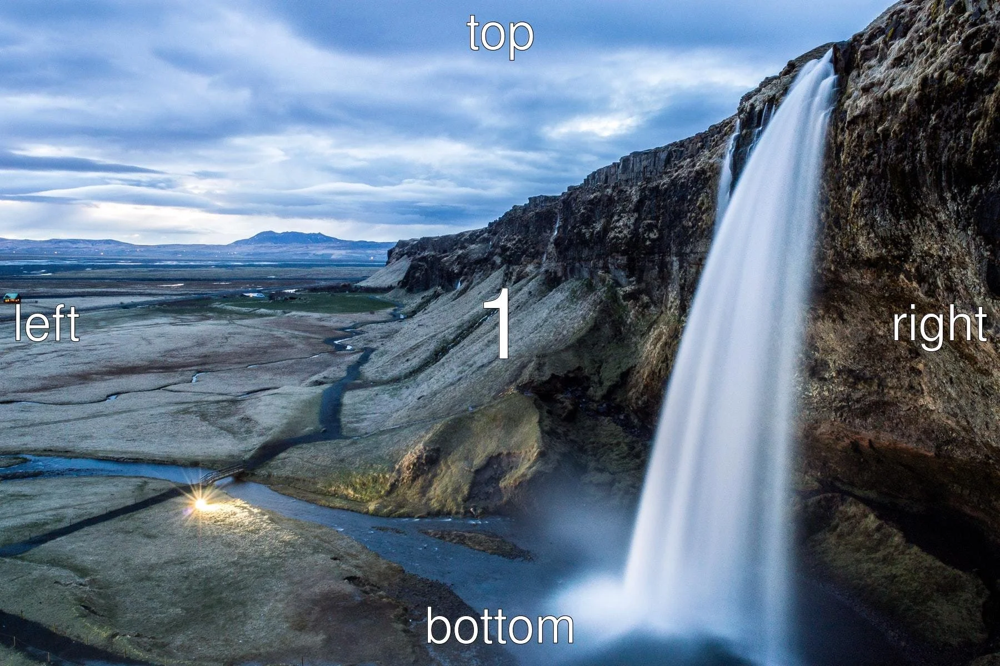
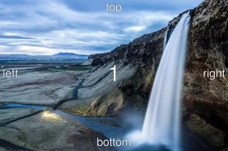

# libvips issue #703

Test case for [libvips/libvips#703](https://github.com/libvips/libvips/issues/703).

The example images for the various EXIF orientation flags are taken from this repo:  
https://github.com/recurser/exif-orientation-examples

## Build
```bash
git clone https://github.com/kleisauke/vips-issue-703.git
cd vips-issue-703
mkdir build && cd build
cmake .. \
  -DCMAKE_BUILD_TYPE=Release
make
```

Or if you prefer to build without CMake:
```bash
git clone https://github.com/kleisauke/vips-issue-703.git
cd vips-issue-703
g++ -g -Wall test-anim.cpp `pkg-config vips-cpp --cflags --libs` -o test-anim
g++ -g -Wall test-single.cpp `pkg-config vips-cpp --cflags --libs` -o test-single
```

## Run
```bash
G_MESSAGES_DEBUG=all ./test-single

# Generate an animated WebP image from the output of `./test-single`
./test-anim
```

See [output/](output) directory.

## Debugging notes
<details>
  <summary>Notes</summary>

  Corner convention:
  ```bash
  vips reducev input/Portrait_1.jpg temp.v 3.749995313 --kernel lanczos3
  vips reduceh temp.v output/Portrait_1.jpg[strip,Q=85] 3.749995313 --kernel lanczos3

  vips reducev input/Portrait_2.jpg temp.v 3.749995313 --kernel lanczos3
  vips reduceh temp.v temp2.v 3.749995313 --kernel lanczos3
  vips flip temp2.v output/Portrait_2.jpg[strip,Q=85] horizontal

  vips reducev input/Portrait_3.jpg temp.v 3.749995313 --kernel lanczos3
  vips reduceh temp.v temp2.v 3.749995313 --kernel lanczos3
  vips rot temp2.v output/Portrait_3.jpg[strip,Q=85] d180

  vips reducev input/Portrait_4.jpg temp.v 3.749995313 --kernel lanczos3
  vips reduceh temp.v temp2.v 3.749995313 --kernel lanczos3
  vips rot temp2.v temp3.v d180
  vips flip temp3.v output/Portrait_4.jpg[strip,Q=85] horizontal

  vips reducev input/Portrait_5.jpg temp.v 3.749995313 --kernel lanczos3
  vips reduceh temp.v temp2.v 3.749995313 --kernel lanczos3
  vips rot temp2.v temp3.v d270
  vips flip temp3.v output/Portrait_5.jpg[strip,Q=85] vertical

  vips reducev input/Portrait_6.jpg temp.v 3.749995313 --kernel lanczos3
  vips reduceh temp.v temp2.v 3.749995313 --kernel lanczos3
  vips rot temp2.v output/Portrait_6.jpg[strip,Q=85] d90

  vips reducev input/Portrait_7.jpg temp.v 3.749995313 --kernel lanczos3
  vips reduceh temp.v temp2.v 3.749995313 --kernel lanczos3
  vips rot temp2.v temp3.v d90
  vips flip temp3.v output/Portrait_7.jpg[strip,Q=85] vertical

  vips reducev input/Portrait_8.jpg temp.v 3.749995313 --kernel lanczos3
  vips reduceh temp.v temp2.v 3.749995313 --kernel lanczos3
  vips rot temp2.v output/Portrait_8.jpg[strip,Q=85] d270

  rm {temp,temp2,temp3}.v
  ```

  Centre convention:
  ```bash
  vips reducev input/Portrait_1.jpg temp.v 3.749995313 --kernel lanczos3
  vips reduceh temp.v output/Portrait_1.jpg[strip,Q=85] 3.749995313 --kernel lanczos3 --centre

  vips reducev input/Portrait_2.jpg temp.v 3.749995313 --kernel lanczos3 --centre
  vips reduceh temp.v temp2.v 3.749995313 --kernel lanczos3  --centre
  vips flip temp2.v output/Portrait_2.jpg[strip,Q=85] horizontal

  vips reducev input/Portrait_3.jpg temp.v 3.749995313 --kernel lanczos3 --centre
  vips reduceh temp.v temp2.v 3.749995313 --kernel lanczos3 --centre
  vips rot temp2.v output/Portrait_3.jpg[strip,Q=85] d180

  vips reducev input/Portrait_4.jpg temp.v 3.749995313 --kernel lanczos3 --centre
  vips reduceh temp.v temp2.v 3.749995313 --kernel lanczos3 --centre
  vips rot temp2.v temp3.v d180
  vips flip temp3.v output/Portrait_4.jpg[strip,Q=85] horizontal

  vips reducev input/Portrait_5.jpg temp.v 3.749995313 --kernel lanczos3 --centre
  vips reduceh temp.v temp2.v 3.749995313 --kernel lanczos3 --centre
  vips rot temp2.v temp3.v d270
  vips flip temp3.v output/Portrait_5.jpg[strip,Q=85] vertical

  vips reducev input/Portrait_6.jpg temp.v 3.749995313 --kernel lanczos3 --centre
  vips reduceh temp.v temp2.v 3.749995313 --kernel lanczos3 --centre
  vips rot temp2.v output/Portrait_6.jpg[strip,Q=85] d90

  vips reducev input/Portrait_7.jpg temp.v 3.749995313 --kernel lanczos3 --centre
  vips reduceh temp.v temp2.v 3.749995313 --kernel lanczos3 --centre
  vips rot temp2.v temp3.v d90
  vips flip temp3.v output/Portrait_7.jpg[strip,Q=85] vertical

  vips reducev input/Portrait_8.jpg temp.v 3.749995313 --kernel lanczos3 --centre
  vips reduceh temp.v temp2.v 3.749995313 --kernel lanczos3 --centre
  vips rot temp2.v output/Portrait_8.jpg[strip,Q=85] d270

  rm {temp,temp2,temp3}.v
  ```

  Only shrink an image vertically (using both `reducev / reduceh`):
  ```bash
  vips reducev input/Portrait_1.jpg output/Portrait_1.jpg[strip,Q=85] 3.749995313 --kernel lanczos3

  vips reducev input/Portrait_2.jpg temp.v 3.749995313 --kernel lanczos3
  vips flip temp.v output/Portrait_2.jpg[strip,Q=85] horizontal

  vips reducev input/Portrait_3.jpg temp.v 3.749995313 --kernel lanczos3
  vips rot temp.v output/Portrait_3.jpg[strip,Q=85] d180

  vips reducev input/Portrait_4.jpg temp.v 3.749995313 --kernel lanczos3
  vips rot temp.v temp2.v d180
  vips flip temp2.v output/Portrait_4.jpg[strip,Q=85] horizontal

  vips reduceh input/Portrait_5.jpg temp.v 3.749995313 --kernel lanczos3
  vips rot temp.v temp2.v d270
  vips flip temp2.v output/Portrait_5.jpg[strip,Q=85] vertical

  vips reduceh input/Portrait_6.jpg temp.v 3.749995313 --kernel lanczos3
  vips rot temp.v output/Portrait_6.jpg[strip,Q=85] d90

  vips reduceh input/Portrait_7.jpg temp.v 3.749995313 --kernel lanczos3
  vips rot temp.v temp2.v d90
  vips flip temp2.v output/Portrait_7.jpg[strip,Q=85] vertical

  vips reduceh input/Portrait_8.jpg temp.v 3.749995313 --kernel lanczos3
  vips rot temp.v output/Portrait_8.jpg[strip,Q=85] d270

  rm {temp,temp2}.v
  ```

  Only shrink an image horizontally (using both `reducev / reduceh`):
  ```bash
  vips reduceh input/Portrait_1.jpg output/Portrait_1.jpg[strip,Q=85] 3.749995313 --kernel lanczos3

  vips reduceh input/Portrait_2.jpg temp.v 3.749995313 --kernel lanczos3
  vips flip temp.v output/Portrait_2.jpg[strip,Q=85] horizontal

  vips reduceh input/Portrait_3.jpg temp.v 3.749995313 --kernel lanczos3
  vips rot temp.v output/Portrait_3.jpg[strip,Q=85] d180

  vips reduceh input/Portrait_4.jpg temp.v 3.749995313 --kernel lanczos3
  vips rot temp.v temp2.v d180
  vips flip temp2.v output/Portrait_4.jpg[strip,Q=85] horizontal

  vips reducev input/Portrait_5.jpg temp.v 3.749995313 --kernel lanczos3
  vips rot temp.v temp2.v d270
  vips flip temp2.v output/Portrait_5.jpg[strip,Q=85] vertical

  vips reducev input/Portrait_6.jpg temp.v 3.749995313 --kernel lanczos3
  vips rot temp.v output/Portrait_6.jpg[strip,Q=85] d90

  vips reducev input/Portrait_7.jpg temp.v 3.749995313 --kernel lanczos3
  vips rot temp.v temp2.v d90
  vips flip temp2.v output/Portrait_7.jpg[strip,Q=85] vertical

  vips reducev input/Portrait_8.jpg temp.v 3.749995313 --kernel lanczos3
  vips rot temp.v output/Portrait_8.jpg[strip,Q=85] d270

  rm {temp,temp2}.v
  ```

  ImageMagick6 test:
  ```bash
  convert -define jpeg:size=1200x1800  input/Portrait_1.jpg  -auto-orient \
          -thumbnail 320x480 -quality 85 output/Portrait_1.jpg
  convert -define jpeg:size=1200x1800  input/Portrait_2.jpg  -auto-orient \
          -thumbnail 320x480 -quality 85 output/Portrait_2.jpg
  convert -define jpeg:size=1200x1800  input/Portrait_3.jpg  -auto-orient \
          -thumbnail 320x480 -quality 85 output/Portrait_3.jpg
  convert -define jpeg:size=1200x1800  input/Portrait_4.jpg  -auto-orient \
          -thumbnail 320x480 -quality 85 output/Portrait_4.jpg
  convert -define jpeg:size=1200x1800  input/Portrait_5.jpg  -auto-orient \
          -thumbnail 320x480 -quality 85 output/Portrait_5.jpg
  convert -define jpeg:size=1200x1800  input/Portrait_6.jpg  -auto-orient \
          -thumbnail 320x480 -quality 85 output/Portrait_6.jpg
  convert -define jpeg:size=1200x1800  input/Portrait_7.jpg  -auto-orient \
          -thumbnail 320x480 -quality 85 output/Portrait_7.jpg
  convert -define jpeg:size=1200x1800  input/Portrait_8.jpg  -auto-orient \
          -thumbnail 320x480 -quality 85 output/Portrait_8.jpg
  ```
</details>

## Output
*Produces pixel shifts*




## Corner vs center convention (portrait)
*Corner convention seems to produce more pixel shifts*


## Shrink an image vertically
*Produces pixel shifts on the vertical axis*


## Shrink an image horizontally
*Produces pixel shifts on the horizontal axis*


## Upscale
*Upscale does not appear to produce pixel shifts*




## After patching
*Portrait seems to be fixed, landscape not*

See this [patch](0001-partially-fix.patch).



